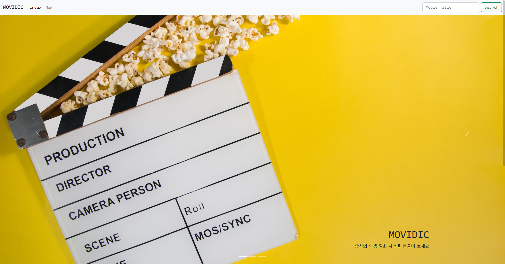
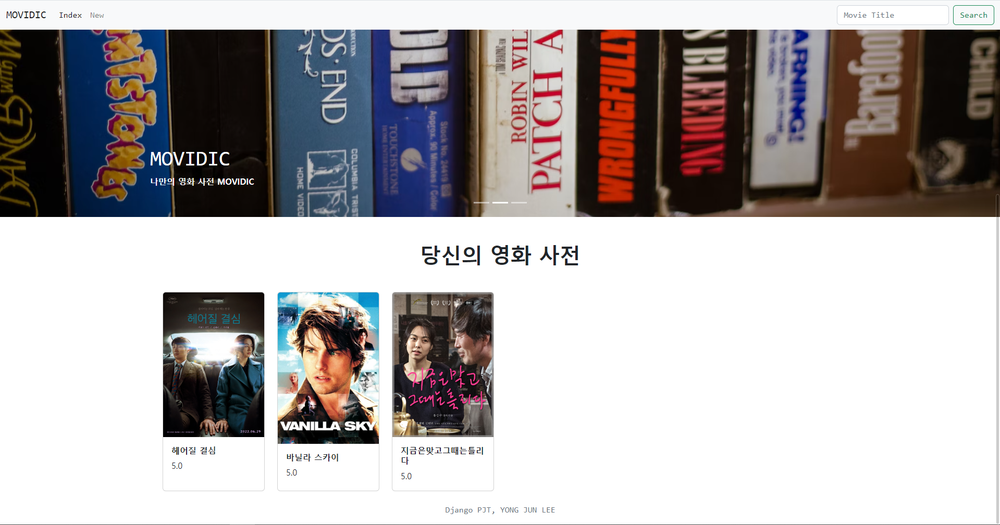
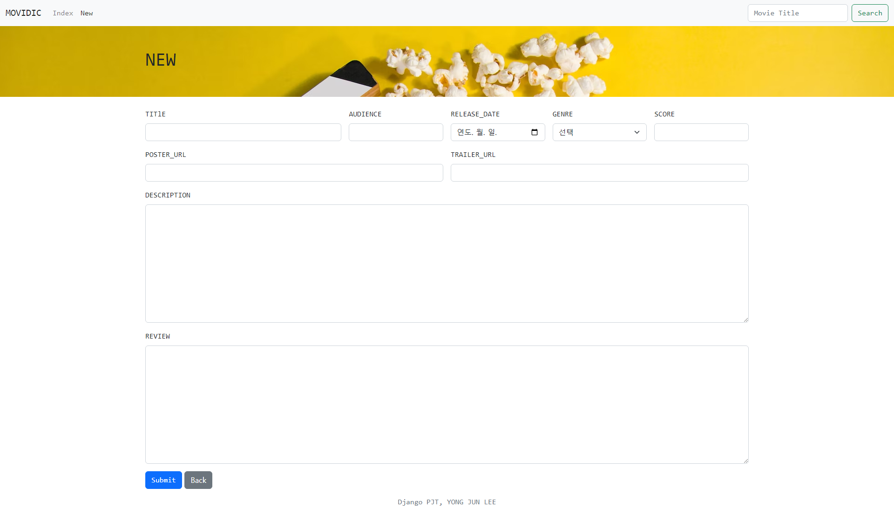
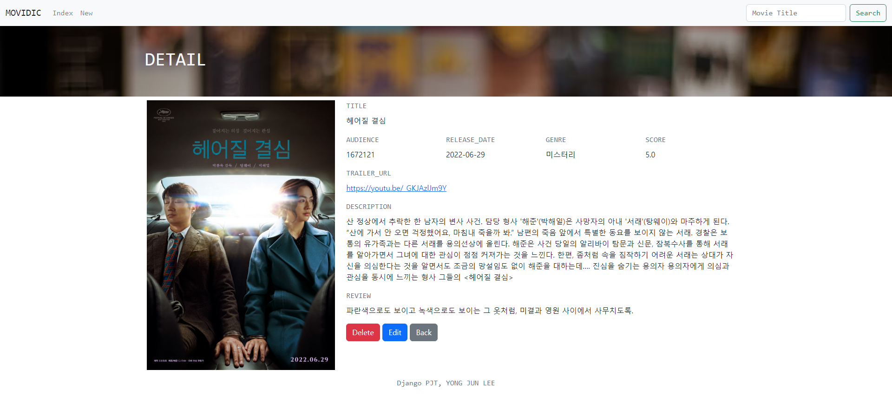
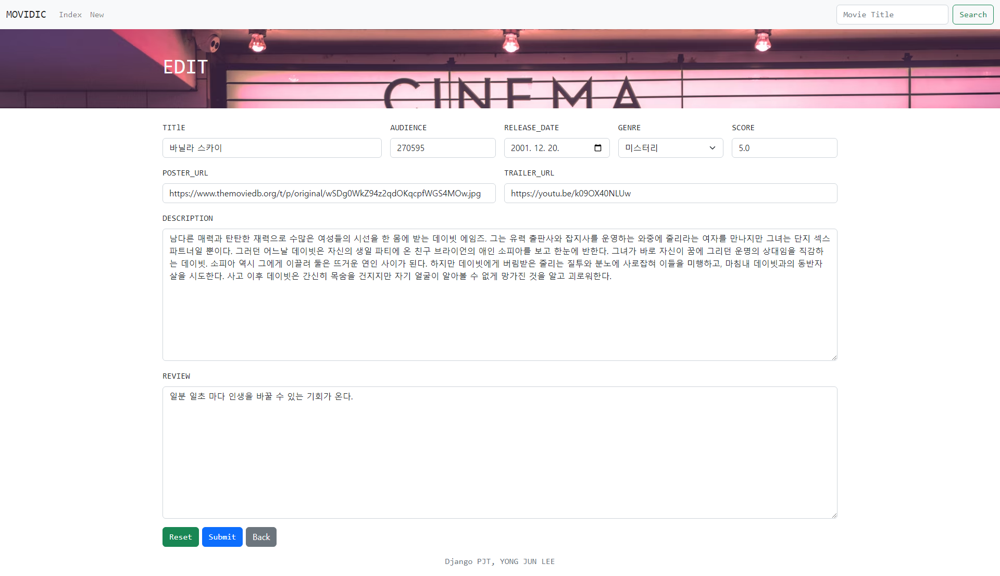
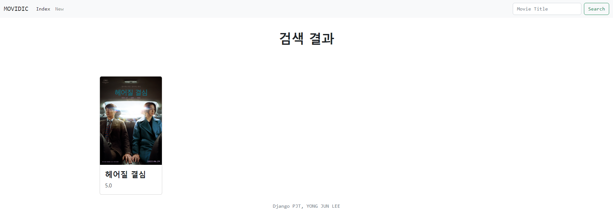

# Django Project: MOVIDIC
기억에 남는 인생 영화에 대한 정보와 평가를 저장하고 조회할 수 있는 서비스입니다.

<br>



<br>

### 프로젝트 목표
* 데이터를 생성,조회,수정,삭제할 수 있는 Webapplication제작
* Djangoweb framework를 사용한 데이터 처리
* DjangoModel과 ORM에 대한 이해
* 관리자 페이지를 통한 데이터 관리

<br>

### 사용 기술
   
  
   
   
  

<br>

### 프로젝트 구조
📦04_pjt<br>
 ┣ 📂movies<br>
 ┃ ┣ 📂migrations<br>
 ┃ ┃ ┣ 📜0001_initial.py<br>
 ┃ ┃ ┗ 📜__init__.py<br>
 ┃ ┣ 📂templates<br>
 ┃ ┃ ┗ 📂movies<br>
 ┃ ┃ ┃ ┣ 📜detail.html<br>
 ┃ ┃ ┃ ┣ 📜edit.html<br>
 ┃ ┃ ┃ ┣ 📜index.html<br>
 ┃ ┃ ┃ ┣ 📜new.html<br>
 ┃ ┃ ┃ ┗ 📜search.html<br>
 ┃ ┣ 📜admin.py<br>
 ┃ ┣ 📜apps.py<br>
 ┃ ┣ 📜models.py<br>
 ┃ ┣ 📜tests.py<br>
 ┃ ┣ 📜urls.py<br>
 ┃ ┣ 📜views.py<br>
 ┃ ┗ 📜__init__.py<br>
 ┣ 📂mypjt<br>
 ┃ ┣ 📜asgi.py<br>
 ┃ ┣ 📜settings.py<br>
 ┃ ┣ 📜urls.py<br>
 ┃ ┣ 📜wsgi.py<br>
 ┃ ┗ 📜__init__.py<br>
 ┣ 📂templates<br>
 ┃ ┗ 📜base.html<br>
 ┣ 📜.gitignore<br>
 ┣ 📜db.sqlite3<br>
 ┣ 📜manage.py<br>
 ┣ 📜README.md<br>
 ┗ 📜requirements.txt<br>

<br>

---

## 00_Model

<br>

| 필드명       | 데이터 타입 | 역할        |
| -------------| ------------|-------------|
| title        | varchar(20) | 영화 제목   |
| audience     | integer     | 관객 수     |
| release_date | date        | 개봉일      |
| genre        | varchar(30) | 장르        |
| score        | float       | 평점        |
| poster_url   | text        | 포스터 경로 |
| trailer_url  | text        | 예고편 경로 |
| description  | text        | 줄거리      |
| review       | text        | 후기        |

<br>

---

## 01_Index

<br>




<br>

> `MOVIDIC`의 `index`페이지입니다.<br>
> 서비스를 소개하는 `header`영역과, 등록한 영화 정보를 확인할 수 있는 `section`영역으로 이루어져 있습니다.<br>
> 영화 카드를 클릭하면, 해당 영화의 상세 페이지로 이동됩니다.

<br>

* `views.index`<br>
  페이지가 요청되면, 등록된 영화 전체 데이터들을 `QuerySet`으로 반환하여 페이지를 렌더링합니다.
  ```python
  def index(request):
  movies = Movie.objects.all()
  context = {
      'movies': movies,
  }
  return render(request, 'movies/index.html', context)
  ```

<br>

---

## 02_New

<br>



<br>

> 영화 정보를 등록할 수 있는 `new` 페이지 입니다.<br>
> `Navigation bar`의 `new`를 통해 접근 가능합니다.<br>
> `Sumbmit` 버튼으로 제출하면 등록한 영화의 상세 페이지로 이동됩니다.

<br>

* `new.form`<br>
  `POST` 방식으로 입력된 데이터들을 서버로 전송합니다.<br>
  `CSRF` 공격을 방지하기 위한 `CSRF_Token`이 들어있습니다.
  ```html
  <form class="row g-3" action="" method="POST">
    
    <div class="col-md-4">
      <label for="title" class="form-label font-monospace">TITlE</label>
      <input type="text" class="form-control" name="title" id="title" required>
    </div>
    ...
    <div class="col-12">
      <button class="btn btn-primary font-monospace" type="submit">Submit</button>
      <a href="" class="btn btn-secondary" role="button">Back</a>
    </div>
  </form>
  ```

<br>

* `views.create`<br>
  `Submit`으로 제출된 데이터들을 `DB`에 저장합니다.<br>
  저장 후 해당 영화의 상세 페이지로 리다이렉트합니다.
  ```python
  def create(request):
    movie = Movie()
    movie.title = request.POST.get('title')
    movie.audience = request.POST.get('audience')
    ...
    movie.save()
    return redirect('movies:detail', movie.pk)
  ```

<br>

---

## 03_Detail

<br>


    
<br>

> 등록된 영화의 상세 내용을 조회하는 `detail` 페이지입니다.<br>
> 해당 영화 데이터를 삭제나 수정을 할 수 있는 버튼이 함께 있습니다.<br>

<br>

* `views.detail`<br>
  `form`을 통해 받아 온 영화 제목 키워드로, 매칭이 되는 데이터들만 필터링하여 새로운 `QuerySet`으로 반환하여 페이지를 렌더링합니다.

  ```python
  def delete(request, pk):
    movie = Movie.objects.get(pk=pk)
    movie.delete()
    return redirect('movies:index')
  ```

<br>

---

## 04_Edit

<br>



<br>

> 등록된 영화의 상세 내용을 수정할 수 있는 `edit` 페이지입니다.<br>

<br>

* `edit.form`<br>
  `new.form`과 같은 방식으로 데이터 전송과 `CSRF` 공격을 대비합니다.<br>
  `Reset` 버튼을 통해 수정 전 초기 상태로 되돌릴 수 있습니다.<br>
  ```html
  <form class="row g-3" action="" method="POST">
    
    <div class="col-md-4">
      <label for="title" class="form-label font-monospace">TITlE</label>
      <input type="text" class="form-control" name="title" id="title" value="{{movie.title}}"required>
    </div>
    ...
    <div class="col-12">
      <input class="btn btn-success font-monospace" type="reset" value="Reset">
      <button class="btn btn-primary font-monospace" type="submit">Submit</button>
      <a href="" class="btn btn-secondary" role="button">Back</a>
    </div>
  </form>
  ```

* `views.detail`과 `views.create`와 같은 방식으로, 영화를 특정하고 영화 정보 데이터를 저장합니다.
  
<br>

---

## 05_Delete

<br>

> 특정 영화 정보를 삭제하기 위한 `url`입니다.<br>

<br>

* `views.delete`<br>
  `detail` 페이지에서 삭제 요청을 통해 함께 받아온 데이터의 `pk`로 해당 영화 정보를 삭제합니다.

  ```python
  def detail(request, pk):
    movie = Movie.objects.get(pk=pk)
    context = {
        'movie': movie,
    }
    return render(request, 'movies/detail.html', context)
  ```

<br>

---

## 06_Search

<br>



<br>

> `Navigation bar`를 통해 영화 제목을 키워드로 검색하면,<br>
> 해당 키워드와 매칭이 되는 영화들이 조회되는 `search` 페이지입니다.<br>

<br>

* `nav.form`<br>
  `Navgiation bar`에서 `form`으로 영화 제목을 입력 받아 서버로 전송합니다.

  ```html
  <nav class="navbar navbar-light navbar-expand-md bg-light fixed-top">
    <div class="container-fluid font-monospace">
      ...
      <form class="d-flex" role="search" action="" method="GET">
        <input class="form-control me-2" type="search" name="title" placeholder="Movie Title" aria-label="Search">
        <button class="btn btn-outline-success" type="submit">Search</button>
      </form>
    </div>
  </nav>
  ```

* `views.search`<br>
  `search/` `url`로 함께 들어온 `title` 파라미터로 특정한 영화들의 `QuerySet`을 반환하여 페이지에 렌더링합니다.

  ```python
  def search(request):
    movies = Movie.objects.filter(title__contains=request.GET.get('title'))
    context = {
        'movies': movies,
    }
    return render(request, 'movies/search.html', context)
  ```

<br>

### 검색 기능을 어떻게 구현할 수 있을까?
* 결국엔 `index` 페이지에서처럼, 영화 데이터들을 `QuerySet`으로 반환시켜 페이지를 렌더링시키면 되는 부분이었습니다.<br>
* 다만 다른 점은, `filter` 메소드를 통해 원하는 영화 정보들만 `QuerySet`에 담아 반환시켜야 한다는 점입니다!
* 필터링에 사용할 키워드는 간단히 `Navigaiton bar`의 `search form`을 `GET` 방식으로 입력을 받으면 됩니다.

<br>  

---

<br>

## 프로젝트 회고

<br>

> 첫 `Django` 프로젝트로 `CRUD` 기능을 구현했습니다.<br>
> `Django`는 처음이지만 다른 프레임워크는 경험이 있었기 때문에,<br>
> 두리뭉실하게 잡혀 있던 `CRUD`의 전체적인 흐름을 다시 한번 되짚고 실습할 수 있었던 좋은 경험이었습니다.<br><br>
> 또한 `HTML`, `CSS`, `Boostrap`을 활용하여 페이지도 간단히 꾸며보았습니다.<br>
> 배운지 불과 한달 밖에 안되었고, 당시엔 손에 익었던 부분들이었는데도 가물가물한 부분이 꽤 많았습니다.<br>
> 확실히 프로그래밍은 익힐 習의 영역을 무시할 수 없다는 걸 다시 한번 자각할 수 있었습니다.<br>
> 배운 기술들을 잊어 버리면 아까우니, 앞으로도 기회가 생길 때마다 종합적으로 활용해 보려고 합니다!<br>